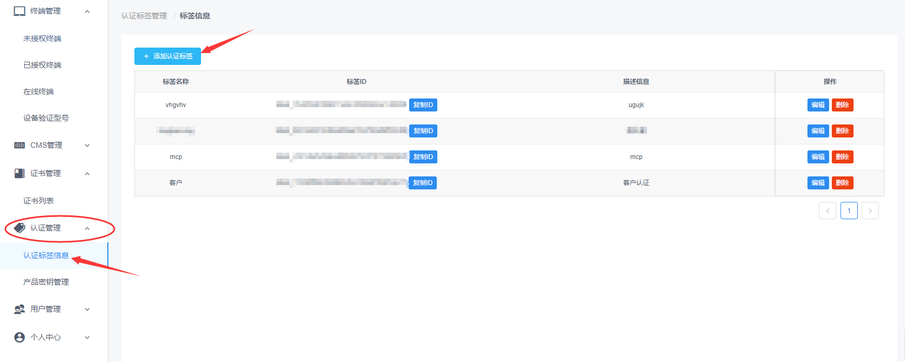
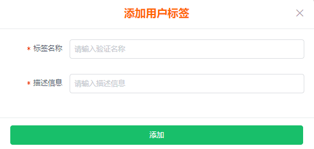
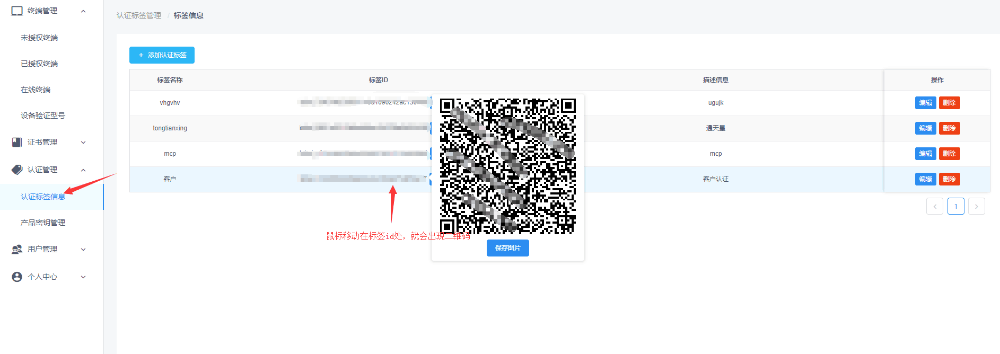
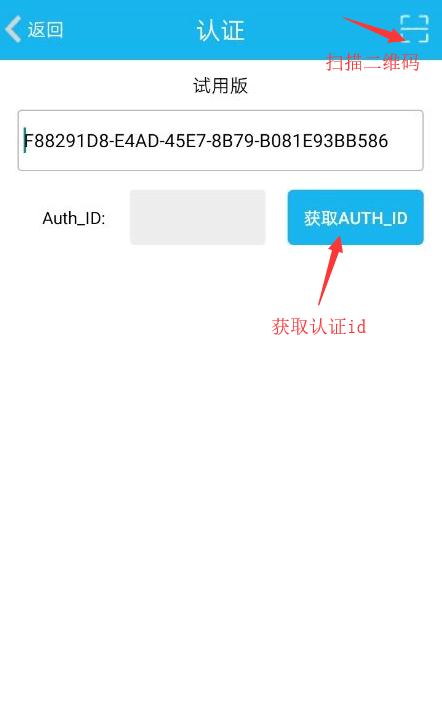
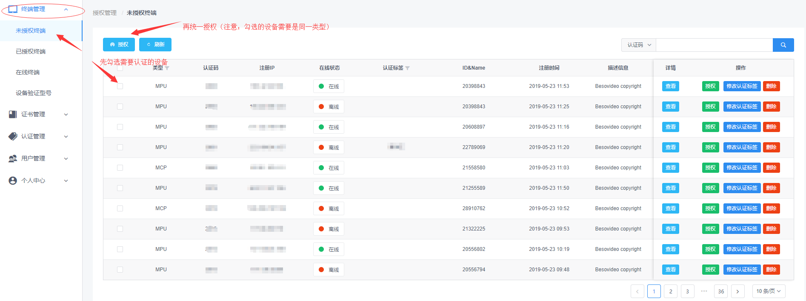
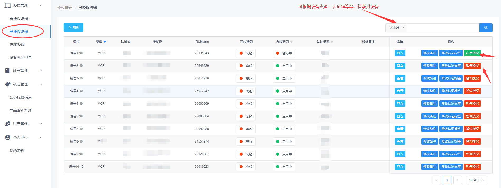
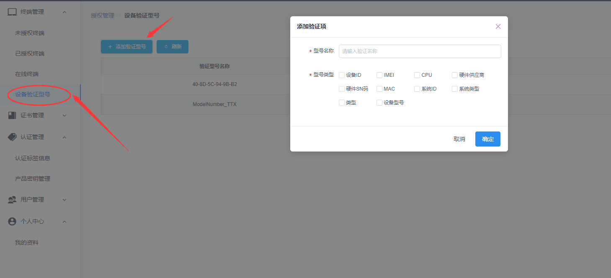
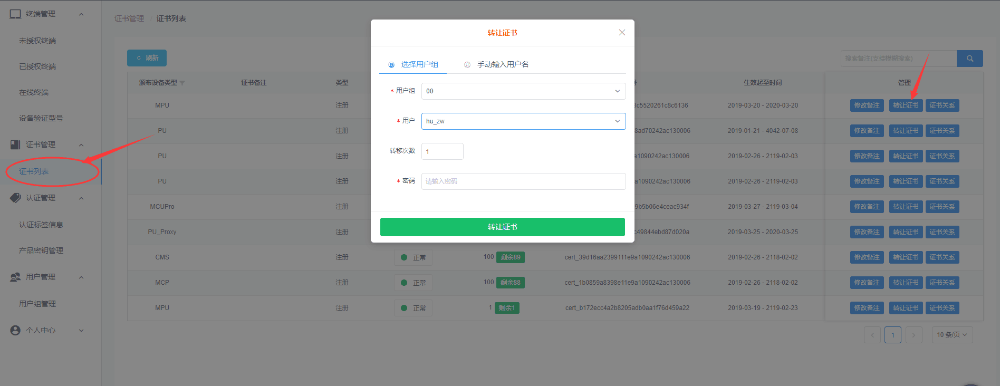

# 认证使用说明

 
 
 

> 注册帐号，联系销售为您颁布认证证书
> 联系方式：汪经理 15395515730 （QQ： 767539593）

- 认证标签
- 设备扫码认证
- 暂停（启用）授权
- 设备型号验证
- 证书管理
- 产品密钥

 

### 1. 添加认证标签
 进入  认证管理--》认证标签管理，并添加认证标签；

  填写用户授权标签名称和用户授权标签描述信息
  

  **认证标签的作用主要是： 方便为不同的客户开设标签，区别不同的客户。**
  
### 2. 扫描二维码
 设备进入认证界面，扫描二维码（认证标签管理里面的不同客户标签ID上，鼠标移动上去，会弹出对应的二维码）
 

 设备认证界面里面的扫描二维码，然后在此界面里面获取认证ID
 
 

### 3.授权认证
认证首页中的终端管理，查看未授权设备，先勾选需要认证的设备；

弹出的认证界面中有默认对应的“证书”和“认证标签”，直接授权，界面会提示授权成功；

----------

**注意：支持设备修改认证标签**

 - 未授权设备修改认证标签，

> 支持修改自己的标签或其他用户的标签；但是修改成其他用户标签后，该用户将不能再查看此设备；

 - 已注册设备修改认证标签
 
> 支持修改自己的标签或其他用户的标签，修改成其他用户标签后，可共同管理改设备；

 

----------

### 4.暂停（或启用）授权

进入认证首页--》终端管理--》已授权设备，可根据相应的检索条件，查找到需要暂停（或启用）的设备，直接暂停或启用授权

### 5.设备验证型号

> 不同的硬件设备，认证系统需要验证不同的硬件关键字段信息，来匹配是不是同一个硬件；
>因此为了减少验证所有字段的重复工作，通过添加某些型号类型，避免设备重复认证；

**类型必选，一个设备可能安装mpu, mcp **
  

### 6.证书管理

目前只有管理员可颁发证书给普通用户，用户可转移证书给其他用户；

### 7.产品密钥

> 产品密钥相当于设备的激活码，设备只要扫描产品密钥生成的二维码，直接完成认证授权，不再需要网页上认证；

进入认证管理--》产品密钥管理，添加产品密钥；

